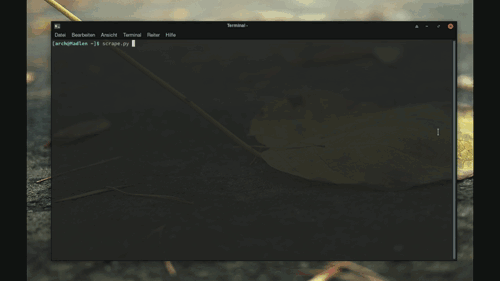

# Scrape


## Installation
Move ```./examples/scrape.py``` into the parent directory or make sure scrap_engine.py is in it's path

## What the game is about
Scrape is basicaly a clone of the snake game, but with some additional modes. The Main goal of the player is to eat as many apples while not dieing.

## Modes
Until now there are 5 modes:
- normal: In this mode you have regularly spawning apples and berrys, the apples make the snake longer but the berrys shorter and faster. Coliding with the walls or the snake it self kills it.
- single: The only difference to the normal mode is that apples and berrys just respawn when one berry/apple is eaten.
- easy: In this mode just aplles exist and coliding with wall does not kill the snake.
- hard: This is the hard mode, here the amount of apples and berrys spawning is the same, but also blocks are spwaned, that will kill the snake at colidation.
- multi: This in the multiplayer mode, in this mode two snakes are present which can be controled seperately. The goal of each player is to kill the other player.
- really_fucking_easy: This is the REALLY FUCKING EASY mode, and it's realy fucking easy. Therefore the snake does not die on crash with itself.

## How to play
General buttons: "e" -- to end the game, "m" -- to pause it

Control buttons: snake1: w,a,s,d; snake2: i,j,k,l

## Resizing
In scrape resizing the game window is supported. Maximizing works flawlessly, minimizing can be tricky, because the snake(s) have to be in the left top corner, when minimizing, else, when the snake(s) are outside of the newly created widows size, they will die.

## Scores
The scores for each mode are saved to ```~/.cache/scrape/scrape ```.

## Hacking
You can hack the game by, for esample, adding modes, which can be ver simply done.
The first thing to do is to add two functions: level_$modename and level_$modename_init, and adding $modename to the modes array in circa line 436. The the mode will be awailable in the menu.

The level_$modename_init function will be executed one time per game, at it's start and the level_$modename function will be executed every frame. It handles for example berry/apple genration.
The level_$modename_init function has to contain the difinition of the Start class which is the class of all objects in the snake. For most modes it is Start=Start_master.
